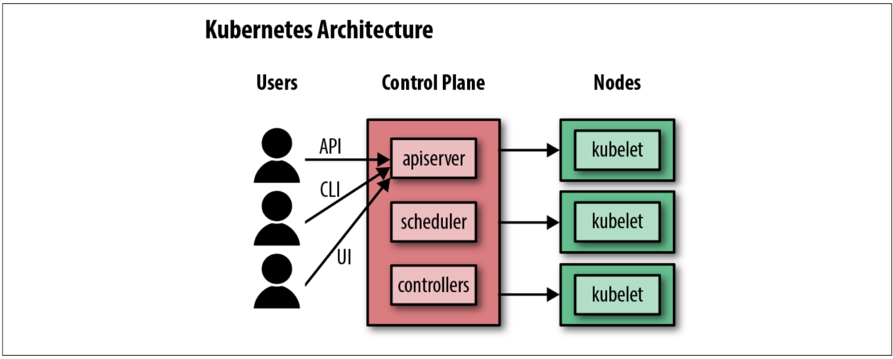
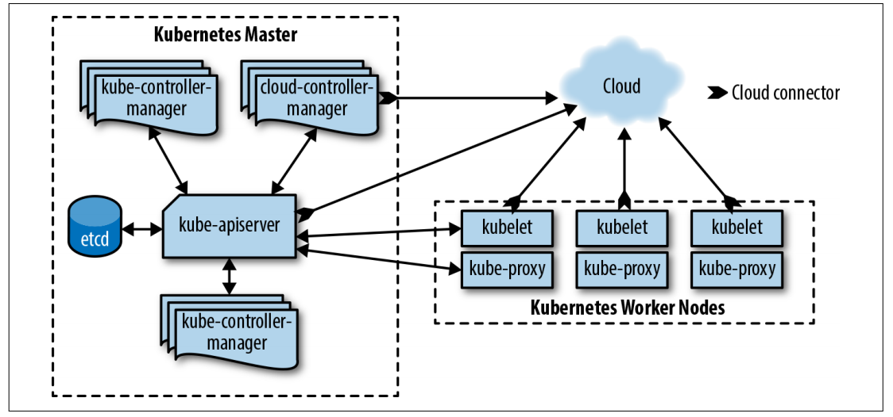

# k8s-for-dummies 


----

- [Introdução](#introdução)
  - [Arquitetura de um cluster](#arquitetura-de-um-cluster)
    - [Control Plane / Master node](#control-plane--master-node)
    - [Worker node](#worker-node)
- [Setup](#setup)
  - [Minikube](#minikube)
    - [Instalação](#instalação)
- [Referências](#referências)

# Introdução

***Kubernetes (K8s)*** *é um produto Open Source utilizado para automatizar a implantação, o dimensionamento e o gerenciamento de aplicativos em contêiner.*
*Ele agrupa contêineres que compõem uma aplicação em unidades lógicas para facilitar o gerenciamento e a descoberta de serviço. O Kubernetes se baseia em 15 anos de experiência na execução de containers em produção no Google, combinado com as melhores ideias e práticas da comunidade.* [[kubernetes.io]](https://kubernetes.io/pt/)


## Arquitetura de um cluster

O Kubernetes conecta diversos servidores em um cluster, sendo ele um grupo de nós interconectados. Podemos considerar que o cluster consiste em dois elementos básicos: ***Master node (Control Plane)*** e ***Worker node***. 

### Control Plane / Master node
O **Control Plane** é o cérebro do cluster Kubernetes, sendo responsável pelo gerenciamento do cluster e também pela coordenação dos *worker nodes*, onde todos os serviços estão em execução. As principais tarefas do *Control Plane* são  são atender requisões de API, escalonar contêineres, e gerenciar *Services*.

O *control plane* é constituído dos seguintes componentes:

**kube-apiserver**: É o servidor frontend do *control plane*, e trata todas as requisições de API.

**etcd**: É o banco de dados que o Kubernetes armazena todas as suas informações: ele mantém os dados de configuração, quais nós existem, quais recursos estão no cluster, etc.

**kube-scheduler**: Decide onde executar os Pods recém-criados.

**kube-controller-manager**: É responsável pela execução dos controladores de recursos, como *DaemonSets*, *Deployments*, *ReplicaSets*, etc. 

**cloud-controller-manager**: Interage com o provedor de cloud (em clusters baseados em cloud), gerenciando recursos como *load balancers* e volumes de disco.



### Worker node

O **Worker Node** é responsável pelo deploy e execução dos contêineres de aplicação. Cada *worker node* de um cluster Kubernetes executa os seguintes componentes:

**kubelet**: É responsável por orientar o runtime do contêiner a iniciar cargas de trabalho (*workloads*) escalonadas no nó e a monitorar seu status.

**kube-proxy**: É um proxy de rede que é executado nos nós e encaminha as requisições entre os Pods em nó distintos e entre os Pods e a Internet.

**container runtime**: Inicia e finaliza os contêinres, além de cuidar de suas comunicações. No geral, o Docker é o mais utilizado, mas o Kubernetes aceita outros runtimes, como rkt e CRI-O.




# Setup

## Minikube

O [Minikube](https://kubernetes.io/docs/setup/learning-environment/minikube/) é uma ferramenta *open source* que permite a execução de um cluster de Kubernetes em uma máquina local. O Minikube inicia um cluster de nó único localmente, com baixa utilização de recursos. É ideal para testes de desenvolvimento e realização de POC's.

### Instalação

O site oficial fornece um breve tutorial para a instalação do Minikube. Basta acessar [Install Minikube
](https://minikube.sigs.k8s.io/docs/start/).

Os requisitos para instalação do Minikube estão [mencionados no tutorial](https://kubernetes.io/docs/tasks/tools/install-minikube/#before-you-begin), mas vale frisar:
- Tenha um hypervisor instalado. Sugestão: [VirtualBox](https://www.virtualbox.org/wiki/Downloads).
- [kubectl](https://kubernetes.io/docs/tasks/tools/install-kubectl/#install-kubectl-on-linux) (ferramenta de linha de comando para interagir com o cluster)

Após instaladas as ferramentas mencionadas acima, verifique a versão do minikube digitando o comando.

```terminal
$ minikube version
minikube version: v1.6.1
commit: 42a9df4854dcea40ec187b6b8f9a910c6038f81a
```

Com o minikube instalado, já é possível criar o cluster em uma máquina virtual, em nosso caso, provisionada através do **VirtualBox**.

Defina o VirtualBox como driver default, para que o minikube possa provisionar uma VM através dele:

```terminal
$ minikube config set vm-driver virtualbox
```

E então, podemos iniciar o cluster.

```terminal
$ minikube start
😄  minikube v1.6.1 on Linuxmint 19
✨  Automatically selected the 'virtualbox' driver (alternates: [none])
🔥  Creating virtualbox VM (CPUs=2, Memory=2000MB, Disk=20000MB) ...
🐳  Preparing Kubernetes v1.17.0 on Docker '19.03.5' ...
💾  Downloading kubeadm v1.17.0
💾  Downloading kubelet v1.17.0
🚜  Pulling images ...
🚀  Launching Kubernetes ... 
⌛  Waiting for cluster to come online ...
🏄  Done! kubectl is now configured to use "minikube"
```

Após o setup inicial do cluster, podemos verificar o status do cluster.

```terminal
$ minikube status
host: Running
kubelet: Running
apiserver: Running
kubeconfig: Configured
```

Agora vamos utilizar o comando `kubectl cluster-info`, para checar se o kubectl consegue se comunicar com o cluster, e verificar se tudo está funcionando corretamente.

```terminal
$ kubectl cluster-info
Kubernetes master is running at https://192.168.99.100:8443
KubeDNS is running at https://192.168.99.100:8443/api/v1/namespaces/kube-system/services/kube-dns:dns/proxy
```

Como podemos ver, temos comunicação com o cluster, e conseguimos verificar o status dos componentes instalados. Para verificar os nós disponíveis, utilizamos o comando `kubectl get nodes`.

```terminal
$ kubectl get nodes
NAME       STATUS   ROLES    AGE   VERSION
minikube   Ready    master   11m   v1.17.0
```

Na saída acima, podemos ver que nosso cluster possui apenas um nó, que foi provisionado com o auxílio do **minikube**. Este é um cenário apenas para ambientes de desenvolvimento e testes locais. Em ambientes de produção é recomendada a utilização de múltiplos nós.


## Referências

* [Documentação Oficial](https://kubernetes.io/docs/concepts/)
* [Cloud Native DevOps with Kubernetes [Book] - O'Reilly](https://www.oreilly.com/library/view/cloud-native-devops/9781492040750/)
